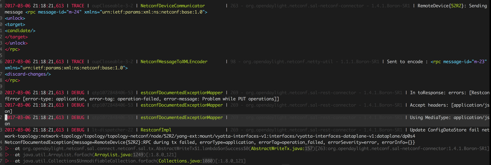

A VIM syntax file for viewing karaf.log files generated by opendaylight using the default logging syntax.

Here is an example with [vim-monokai](https://github.com/sickill/vim-monokai).


## Notes:
- Assumes the following configuration in org.ops4j.pax.logging.cfg file:
```
log4j.appender.out.layout.ConversionPattern=%d{ISO8601} | %-5.5p | %-16.16t | %-32.32c{1} | %X{bundle.id} - %X{bundle.name} - %X{bundle.version} | %m%n
```

## TODO:
- Add JSON formatting & keywords.
- Inherit xml/json run-time instead of manually parsing?
- Log-region 6 inherits highlighting of Log-region 2
